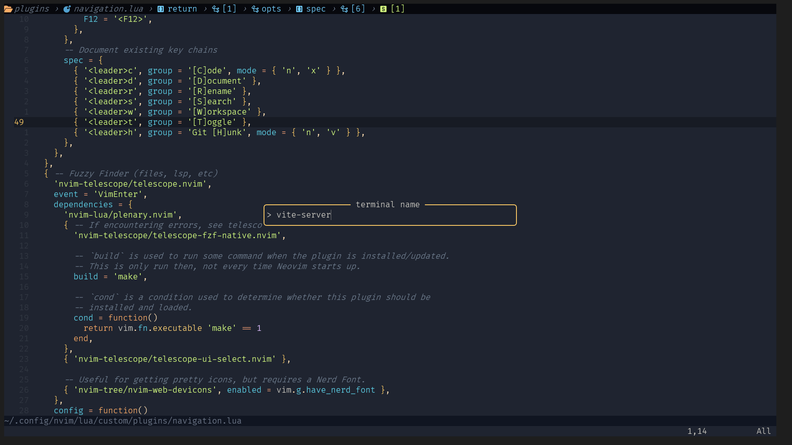
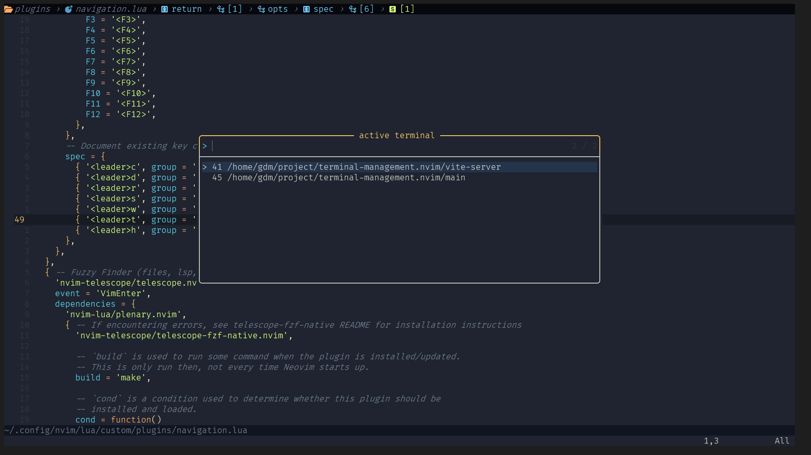

# Description

a very simple utility plugin to manage multiple terminal window without leaving neovim




# Installation

```lua
{
    "rsnorlatch/terminal-management.nvim"
    dependencies = {
      'nvim-telescope/telescope.nvim',
      'MunifTanjim/nui.nvim',
    },
}
```

# Usage Example
```lua
      local terminal_management = require 'terminal-management'

      vim.keymap.set('n', '<leader>tt', function()
        terminal_management.create_terminal()
      end, { desc = 'creates new terminal' })

      vim.keymap.set('n', '<leader>st', function()
        terminal_management.get_active_terminal()
      end, { desc = '[S]earch [T]erminal' })

      vim.keymap.set('n', '<C-l>', function()
        terminal_management.previous_terminal()
      end)

      vim.keymap.set('n', '<C-k>', function()
        terminal_management.next_terminal()
      end)
    end,

```

